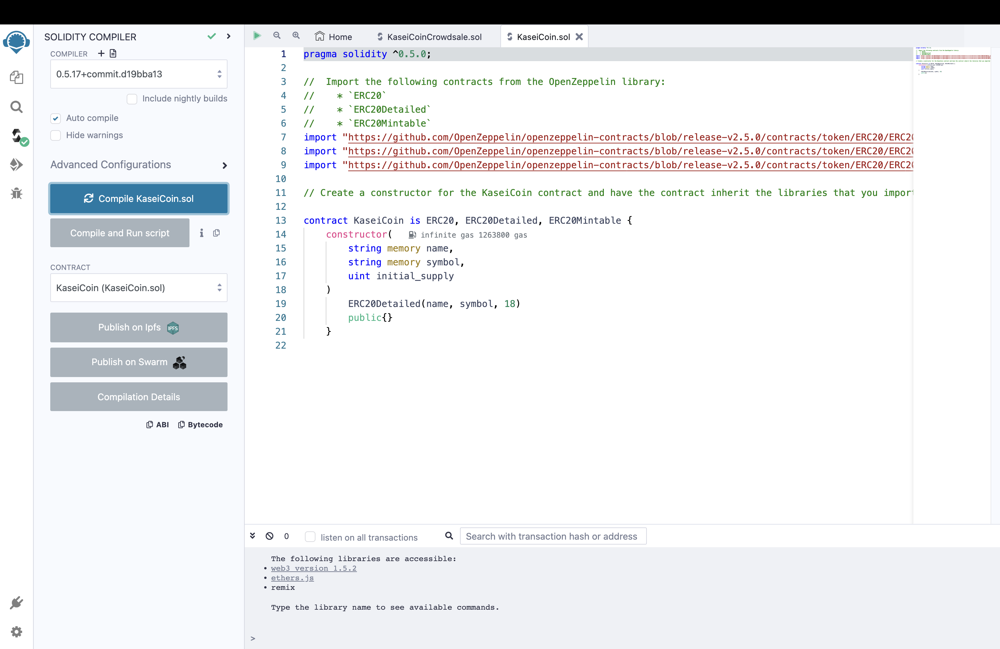
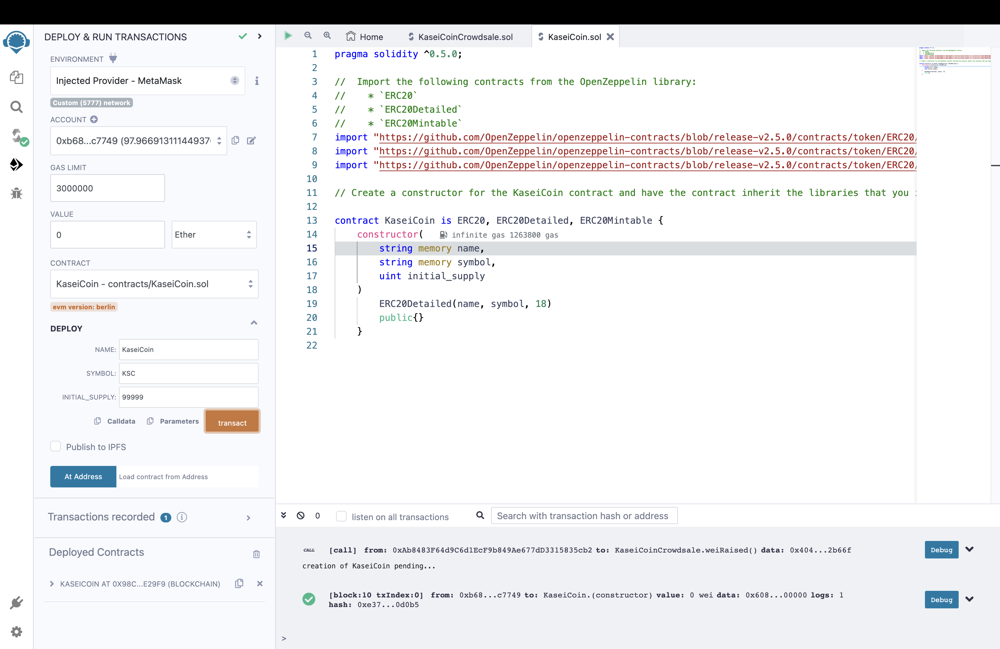
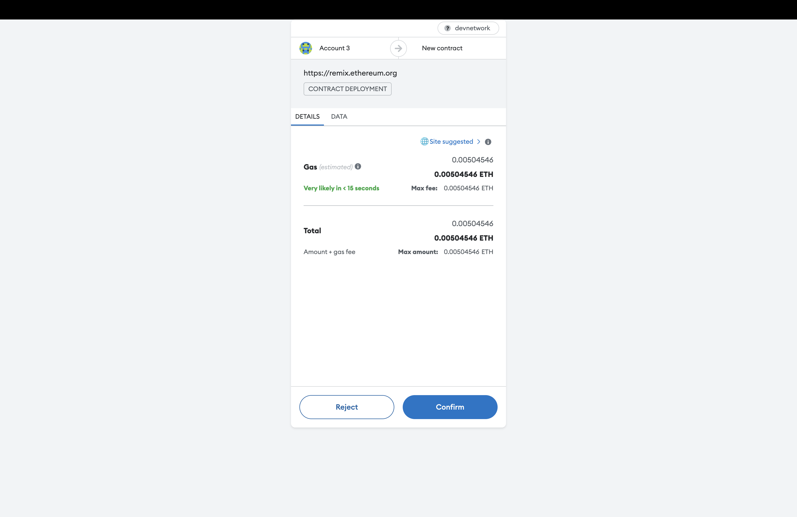
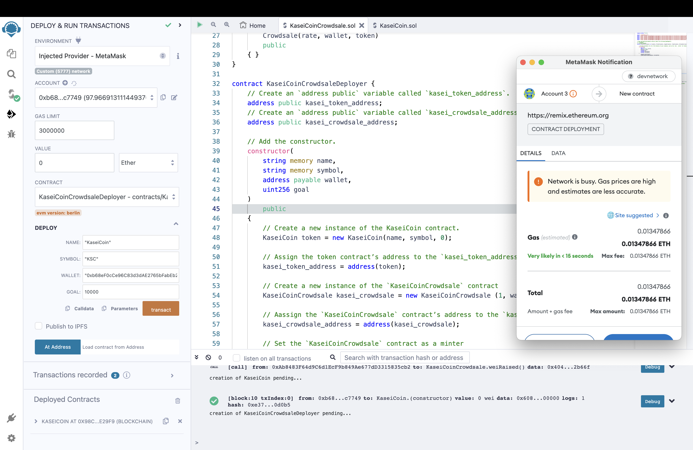
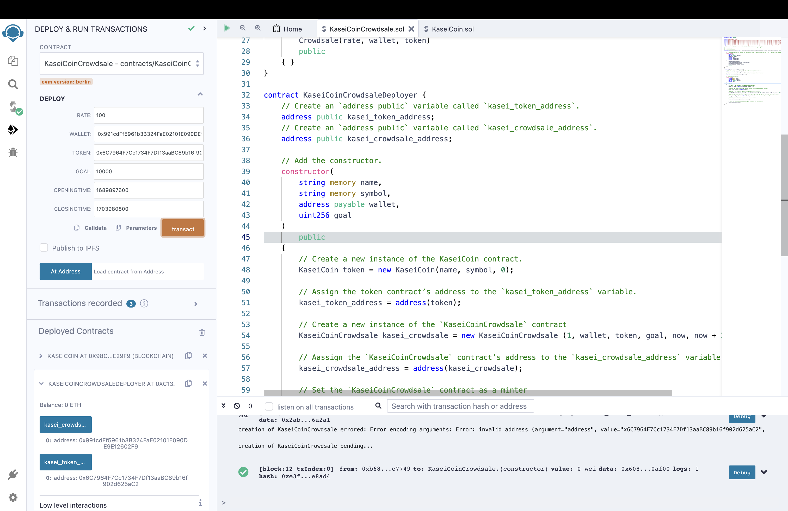
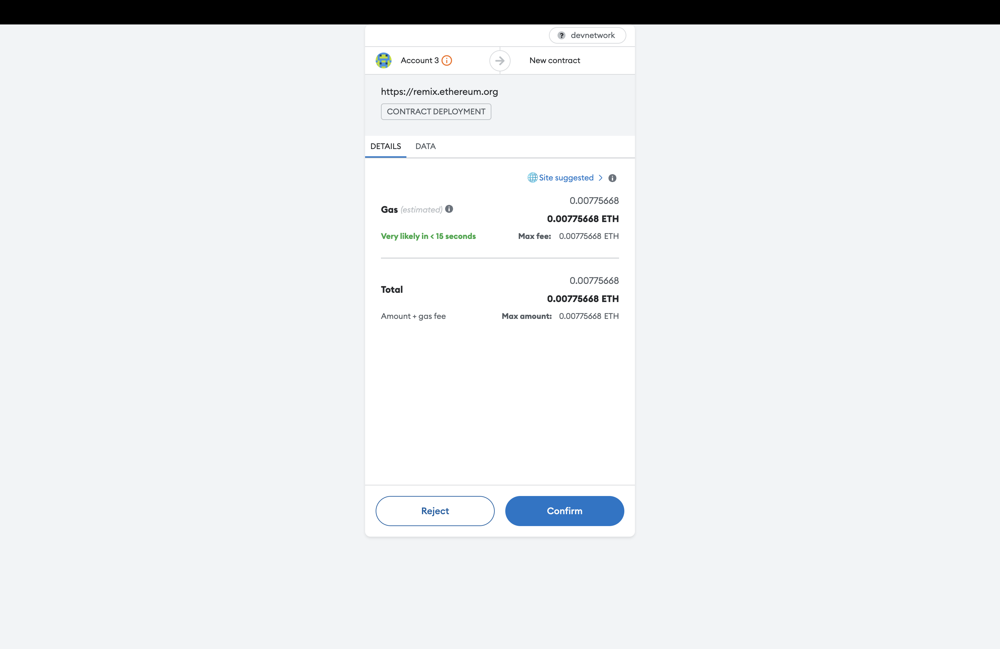

# KaseiCoin Crowdsale

Based on blockchain technology, KaseiCoin is a fungible ERC-20 compliant token. The KaseiCoin crowdsale aims to enable individuals migrating to Mars to convert their Earthling money into KaseiCoin.

## Create and Deploy the KaseiCoin Contract

1. Compile KaseiCoin Contract

2. Deploy the KaseiCoin Contract with environment of MetaMask

## Deploy KaseiCoin Deployer Contract

## Deploy KaseiCoin Crowdsale Contract

1. Rate: 100;
2. Goal: to raise 10000 ether during the crowdsale
3. Crowdsale period: 2023-7-21 0:0:0 (Epoch timestamp: 1689897600) to 2023-12-31 0:0:0 (Epoch timestamp: 1703980800)

